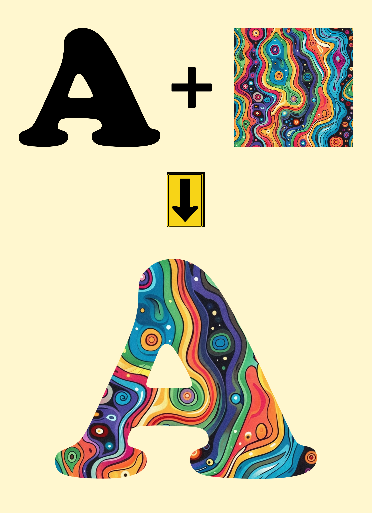

# Simple Stylish Font Generator

Simple Stylish Font Generator is a Python-based tool designed to generate stylish fonts by blending input images with text. The script processes images, applies transformations, and combines them with text to create visually appealing and unique font styles.

## Features

- Generate stylish fonts from images
- Support for custom fonts
- Randomized transformations (rotations and flips)
- Multithreading for efficient processing
- Organized output directories

## Requirements

- Python 3.x
- Pillow (Python Imaging Library)

You can install the required packages using:

```bash
pip install -r requirements.txt
```

## Usage

1. Place your input images and `__INFO.txt` file in a folder under the `input` directory.
2. Run the script using:

```bash
python main.py
```

3. The output will be generated in the `output` directory.
4. You can place multiple input folder's and get all the output, 10 input will process at once with `threading`

## Example

The script takes an input letter and an image, applies transformations, and combines them to produce a stylish font. Here is an example of what the script does:



## Directory Structure

- `font/`: Directory for font files.
- `input/`: Directory for input images and data.
- `output/`: Directory for generated outputs.
- `main.py`: Main Python script.
- `requirements.txt`: List of required Python packages.


## Contributing

Contributions are welcome! Please open an issue or submit a pull request for any improvements or bug fixes.
